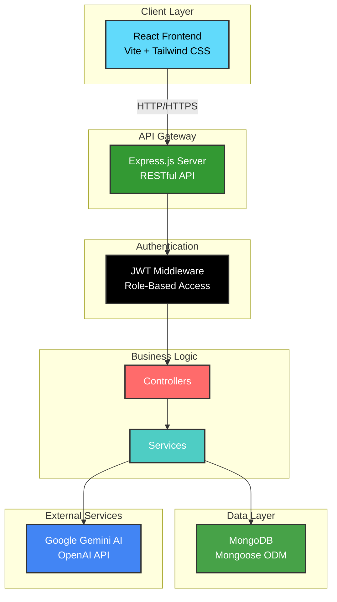
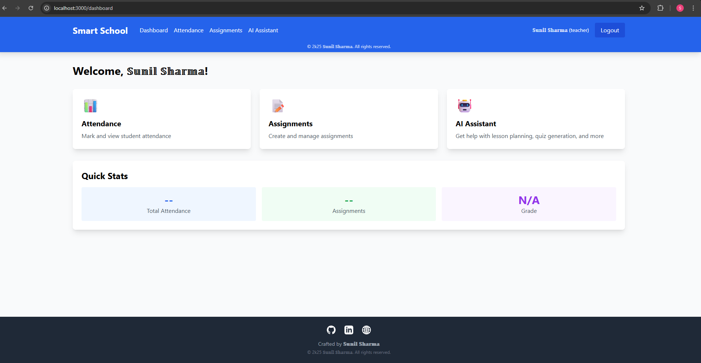

<div align="center">

# 🎓 AI-Powered Smart School Management System

[](https://reactjs.org/)
[](https://nodejs.org/)
[](https://www.mongodb.com/)
[](https://expressjs.com/)
[](https://tailwindcss.com/)
[](https://ai.google.dev/)

[](LICENSE)
[](CONTRIBUTING.md)
[](https://github.com/sunbyte16/smart-school-management/stargazers)
[](https://github.com/sunbyte16/smart-school-management/network/members)

**A comprehensive full-stack school management system with AI-powered features for modern education**

[Features](#-features) • [Demo](#-demo) • [Installation](#-installation) • [Usage](#-usage) • [API](#-api-documentation) • [Contributing](#-contributing)

</div>

---

## 📋 Table of Contents

- [Overview](#-overview)
- [Features](#-features)
- [Tech Stack](#-tech-stack)
- [Project Structure](#-project-structure)
- [Installation](#-installation)
- [Configuration](#-configuration)
- [Usage](#-usage)
- [API Documentation](#-api-documentation)
- [Screenshots](#-screenshots)
- [Contributing](#-contributing)
- [License](#-license)
- [Contact](#-contact)

---

## 🌟 Overview

The **AI-Powered Smart School Management System** is a modern, full-stack web application designed to streamline educational institution management. It combines traditional school management features with cutting-edge AI capabilities to enhance teaching and learning experiences.

### 🎯 Key Highlights

- 🔐 **Secure Authentication** - JWT-based authentication system
- 👥 **Role-Based Access** - Separate interfaces for Teachers and Students
- 📊 **Attendance Tracking** - Real-time attendance management
- 📝 **Assignment Management** - Create, submit, and track assignments
- 🤖 **AI Assistant** - Powered by Google Gemini or OpenAI
- 🎨 **Modern UI** - Beautiful, responsive design with Tailwind CSS
- ⚡ **Fast & Efficient** - Built with React and Node.js for optimal performance

---

## ✨ Features

### 👨‍🏫 For Teachers

- ✅ Mark and manage student attendance
- 📚 Create and distribute assignments
- 🤖 Generate lesson plans using AI
- 📝 Create quizzes automatically with AI
- 💬 Get teaching assistance from AI chatbot
- 📊 View student submissions and progress

### 👨‍🎓 For Students

- 📅 View attendance records
- 📖 Access and submit assignments
- 🤖 Get homework help from AI assistant
- 💡 Interactive learning support
- 📈 Track academic progress

### 🤖 AI-Powered Features

- **Smart Chat Assistant** - Get instant answers to educational queries
- **Lesson Plan Generator** - Create comprehensive lesson plans in seconds
- **Quiz Generator** - Automatically generate quizzes with multiple-choice questions
- **Educational Support** - Context-aware assistance for teaching and learning

---

## 🛠️ Tech Stack

### Frontend


### Backend


### AI Integration


---

## 🏗️ Modern Architecture

<div align="center">



</div>

### 🔄 Architecture Layers

#### 🎨 **Presentation Layer**
- **React Components** - Modular, reusable UI components
- **React Router** - Client-side routing and navigation
- **Tailwind CSS** - Utility-first styling
- **Axios** - HTTP client for API communication

#### 🔐 **Security Layer**
- **JWT Authentication** - Stateless token-based auth
- **Role-Based Access Control** - Teacher/Student permissions
- **Password Hashing** - bcrypt encryption
- **Protected Routes** - Middleware authorization

#### ⚙️ **Application Layer**
- **RESTful API** - Standard HTTP methods
- **MVC Pattern** - Model-View-Controller architecture
- **Service Layer** - Business logic separation
- **Error Handling** - Centralized error management

#### 💾 **Data Layer**
- **MongoDB** - NoSQL document database
- **Mongoose ODM** - Schema validation and modeling
- **Data Models** - User, Attendance, Assignment schemas
- **Indexing** - Optimized query performance

#### 🤖 **AI Integration Layer**
- **Google Gemini API** - Natural language processing
- **OpenAI API** - Alternative AI provider
- **Service Abstraction** - Unified AI interface
- **Context Management** - Conversation history

### 🔗 Data Flow

```
User Request → React Component → API Service → Express Route 
→ Auth Middleware → Controller → Service Layer → Database/AI API 
→ Response → React Component → UI Update
```

---

## 🚀 Installation

### Prerequisites

Before you begin, ensure you have the following installed:

-  Node.js (v16 or higher)
-  MongoDB (local or Atlas)
-  npm or yarn package manager

### Step 1: Clone the Repository

```bash
git clone https://github.com/sunbyte16/smart-school-management.git
cd smart-school-management
```

### Step 2: Backend Setup

```bash
# Navigate to backend directory
cd backend

# Install dependencies
npm install

# Create .env file
copy .env.example .env
```

### Step 3: Configure Environment Variables

Edit `backend/.env` with your credentials:

```env
PORT=5000
MONGODB_URI=your_mongodb_connection_string
JWT_SECRET=your_jwt_secret_key_here

# Choose ONE AI provider:
# Option 1: Google Gemini (Free tier available)
GEMINI_API_KEY=your_gemini_api_key

# Option 2: OpenAI (Requires credits)
# OPENAI_API_KEY=your_openai_api_key

NODE_ENV=development
```

#### 🔑 Getting API Keys

**Google Gemini API (Recommended - Free):**
1. Visit [Google AI Studio](https://aistudio.google.com/app/apikey)
2. Sign in with your Google account
3. Click "Create API Key"
4. Copy and paste into `.env`

**OpenAI API:**
1. Visit [OpenAI Platform](https://platform.openai.com/api-keys)
2. Create an account and add billing
3. Generate API key
4. Copy and paste into `.env`

### Step 4: Frontend Setup

```bash
# Navigate to frontend directory (from root)
cd frontend

# Install dependencies
npm install
```

### Step 5: Start the Application

**Terminal 1 - Backend:**
```bash
cd backend
npm run dev
```

**Terminal 2 - Frontend:**
```bash
cd frontend
npm run dev
```

### Step 6: Access the Application

🌐 Open your browser and navigate to:
- **Frontend:** http://localhost:3000
- **Backend API:** http://localhost:5000

### Step 7: Demo Login Credentials

🔐 **Test the application with demo account:**

```
📧 Email:    skimar2233@gmail.com
🔑 Password: Admin@123
👤 Role:     Teacher (Full Access)
```

**Login at:** http://localhost:3000

---

## ⚙️ Configuration

### MongoDB Setup

**Option 1: MongoDB Atlas (Cloud - Recommended)**
1. Create account at [MongoDB Atlas](https://www.mongodb.com/cloud/atlas)
2. Create a new cluster
3. Get connection string
4. Add to `.env` file

**Option 2: Local MongoDB**
```bash
# Install MongoDB locally
# Update .env with: MONGODB_URI=mongodb://localhost:27017/smart-school
```

### Environment Variables Reference

| Variable | Description | Required | Default |
|----------|-------------|----------|---------|
| `PORT` | Backend server port | No | 5000 |
| `MONGODB_URI` | MongoDB connection string | Yes | - |
| `JWT_SECRET` | Secret key for JWT tokens | Yes | - |
| `GEMINI_API_KEY` | Google Gemini API key | Yes* | - |
| `OPENAI_API_KEY` | OpenAI API key | Yes* | - |
| `NODE_ENV` | Environment mode | No | development |

*Either GEMINI_API_KEY or OPENAI_API_KEY is required

---

## 📖 Usage

### 1️⃣ Register an Account

- Navigate to http://localhost:3000
- Click "Register"
- Choose role: **Teacher** or **Student**
- Fill in details and submit

### 2️⃣ Login

- Enter your email and password
- Click "Login"

### 3️⃣ Explore Features

#### For Teachers:
- **Dashboard:** Overview of your classes
- **Attendance:** Mark student attendance
- **Assignments:** Create and manage assignments
- **AI Assistant:** Generate lesson plans and quizzes

#### For Students:
- **Dashboard:** View your academic overview
- **Attendance:** Check your attendance records
- **Assignments:** View and submit assignments
- **AI Assistant:** Get homework help

---

## 📡 API Documentation

### Authentication Endpoints

#### Register User
```http
POST /api/auth/register
Content-Type: application/json

{
  "name": "Sunil Sharma",
  "email": "Sunil@gmail.com",
  "password": "password123",
  "role": "teacher",
  "grade": "10th"
}
```

#### Login
```http
POST /api/auth/login
Content-Type: application/json

{
  "email": "Ajay@gmail.com",
  "password": "password123"
}
```

### Attendance Endpoints

#### Mark Attendance (Teachers Only)
```http
POST /api/attendance
Authorization: Bearer {token}
Content-Type: application/json

{
  "studentId": "user_id",
  "date": "2024-01-15",
  "status": "present",
  "notes": "Optional notes"
}
```

#### Get Attendance Records
```http
GET /api/attendance?studentId={id}&startDate={date}&endDate={date}
Authorization: Bearer {token}
```

### Assignment Endpoints

#### Create Assignment (Teachers Only)
```http
POST /api/assignments
Authorization: Bearer {token}
Content-Type: application/json

{
  "title": "Math Homework",
  "description": "Complete exercises 1-10",
  "dueDate": "2024-01-20",
  "grade": "10th"
}
```

#### Get All Assignments
```http
GET /api/assignments?grade={grade}
Authorization: Bearer {token}
```

#### Submit Assignment (Students)
```http
POST /api/assignments/{assignmentId}/submit
Authorization: Bearer {token}
Content-Type: application/json

{
  "content": "Assignment submission content"
}
```

### AI Assistant Endpoints

#### Chat with AI
```http
POST /api/ai/chat
Authorization: Bearer {token}
Content-Type: application/json

{
  "messages": [
    {"role": "user", "content": "Explain photosynthesis"}
  ]
}
```

#### Generate Lesson Plan
```http
POST /api/ai/lesson-plan
Authorization: Bearer {token}
Content-Type: application/json

{
  "topic": "Photosynthesis",
  "grade": "10th"
}
```

#### Generate Quiz
```http
POST /api/ai/quiz
Authorization: Bearer {token}
Content-Type: application/json

{
  "topic": "World War II",
  "grade": "10th",
  "numQuestions": 5
}
```

---

## 📸 Screenshots

<div align="center">

### 🔐 Login & Registration Page
*Beautiful gradient interface with OAuth integration options*


---

### 🏠 Dashboard - Teacher View
*Clean, card-based dashboard with quick access to all features*



---

### 📊 Attendance Management
*Mark and track student attendance with ease*


---

### 🤖 AI Assistant
*Intelligent educational assistant with chat, lesson plans, and quiz generation*


</div>

---

## 🤝 Contributing

Contributions are what make the open-source community such an amazing place to learn, inspire, and create. Any contributions you make are **greatly appreciated**.

### How to Contribute

1. **Fork the Project**
2. **Create your Feature Branch**
   ```bash
   git checkout -b feature/AmazingFeature
   ```
3. **Commit your Changes**
   ```bash
   git commit -m 'Add some AmazingFeature'
   ```
4. **Push to the Branch**
   ```bash
   git push origin feature/AmazingFeature
   ```
5. **Open a Pull Request**

### Development Guidelines

- Follow the existing code style
- Write meaningful commit messages
- Add comments for complex logic
- Test your changes thoroughly
- Update documentation as needed

---

## 📝 License

Distributed under the MIT License. See `LICENSE` for more information.

---

## 📞 Contact

<div align="center">

### Made with ❤️ by **�𝕦�𝕟𝕚𝕝 �𝕙𝕒�𝕣𝕞𝕒**

[](https://github.com/sunbyte16)
[](https://www.linkedin.com/in/sunil-kumar-bb88bb31a/)
[](https://lively-dodol-cc397c.netlify.app)

**⭐ If you found this project helpful, please give it a star!**

</div>

---

## 🙏 Acknowledgments

- [React Documentation](https://reactjs.org/)
- [Node.js Documentation](https://nodejs.org/)
- [MongoDB Documentation](https://docs.mongodb.com/)
- [Tailwind CSS](https://tailwindcss.com/)
- [Google Gemini AI](https://ai.google.dev/)
- [OpenAI](https://openai.com/)

---

<div align="center">

### 🌟 Star this repository if you find it helpful! 🌟

**Made with ❤️ by 𝕊𝕦𝕟𝕚𝕝 𝕊𝕙𝕒𝕣𝕞𝕒**


---

### 📱 Connect With Me

[](https://github.com/sunbyte16)
[](https://www.linkedin.com/in/sunil-kumar-bb88bb31a/)
[](https://lively-dodol-cc397c.netlify.app)

---

### Made with ❤️ by **𝕊���𝕝 𝕊�𝕒ight𝕣𝕞𝕒**

**© 2k25 𝕊𝕦𝕟𝕚𝕝 𝕊𝕙𝕒𝕣𝕞𝕒. All rights reserved.**

</div>
# Smart-School-Management-System

